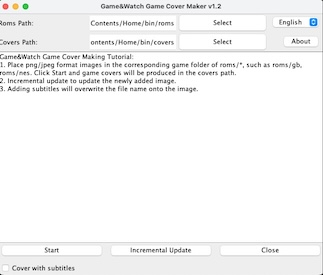

# GameWatchCoverMaker

game&amp;watch SD card solution game cover tool, no system environment configuration required, supports windows and mac

GameWatchCoverMaker

A tool for visualizing and processing images of Nintendo® Game & Watch™ Retro-Go SD projects

##Function Introduction

- No environment configuration is required. It supports running on both mac and windows
- When png/jpeg format covers are placed in the same directory as the game, corresponding cover files can be produced.
- Support adding file names as subtitles to the game cover
- Hidden function: Extract game resources of the "Jumping Pit Alliance"

Nintendo ® Game & Watch ™ Retro - Go SD project at [https://github.com/sylverb/game-and-watch-retro-go-sd](https://github.com/sylverb/game-and-watch-retro-go-sd)

